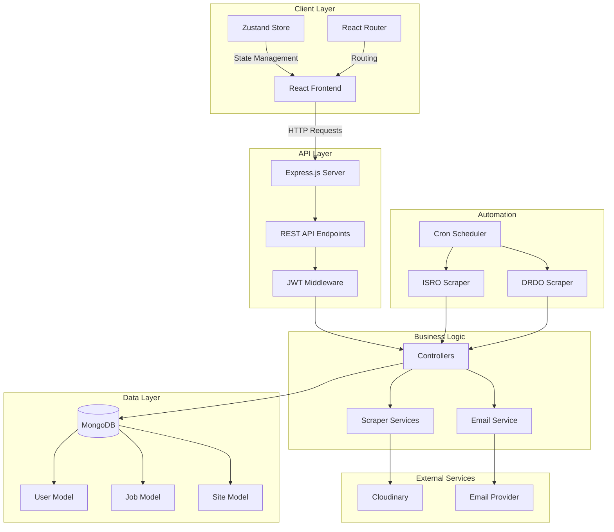
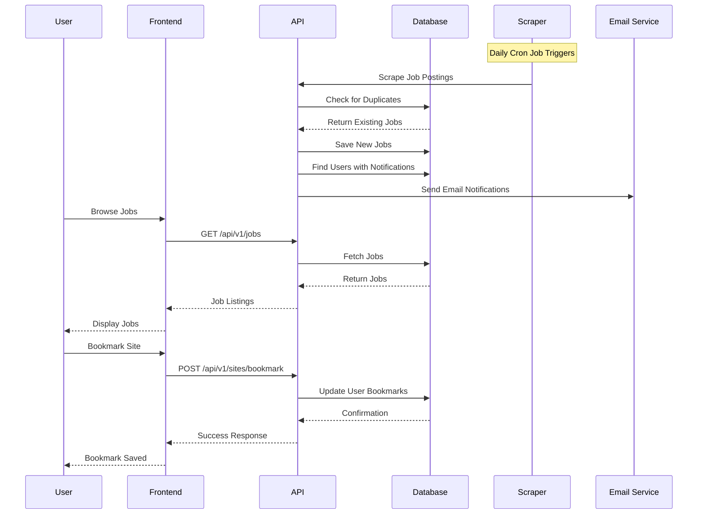
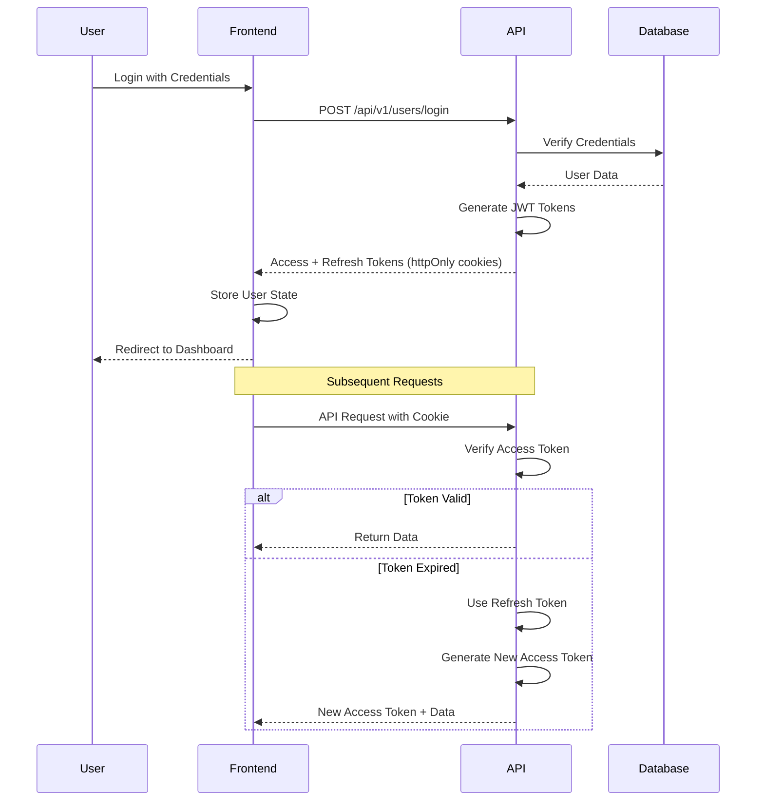
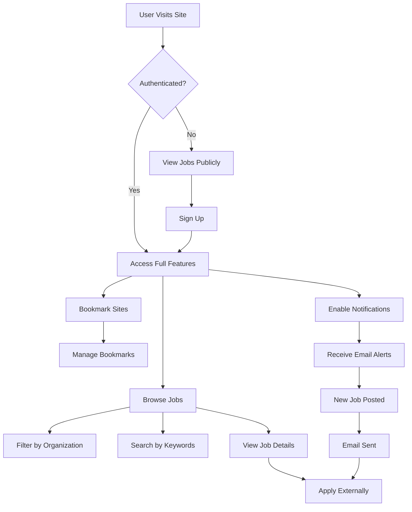

  #    JobScrape -     Automated Job Scraper & Aggregator

<div align="center">


**An intelligent platform that automatically scrapes, aggregates, and notifies users about government and research organization job postings.**

[Features](#-features) • [Tech Stack](#-tech-stack) • [Installation](#-installation) • [Usage](#-usage) •<a href = "https://github.com/anuj-1402/jojo/blob/main/sfront/API_INTEGRATION.md">Api Documentation</a>


</div>

---

## 👥 Development Team

<div align="center">

<table>
  <tr>
    <td align="center" width="33%">
      <br />
      <sub><b>Pritpan</b></sub><br />
      <a href="https://github.com/Pritpan">@Pritpan</a><br />
      <sub>Full Stack Developer</sub>
    </td>
    <td align="center" width="33%">
      <br />
      <sub><b>Anuj</b></sub><br />
      <a href="https://github.com/anuj-1402">@anuj-1402</a><br />
      <sub>Full Stack Developer</sub>
    </td>
    <td align="center" width="33%">
      <br />
      <sub><b>Saurabh</b></sub><br />
      <a href="https://github.com/Saurabh1127">@Saurabh1127</a><br />
      <sub>Full Stack Developer</sub>
    </td>
  </tr>
</table>

</div>

---

## 📋 Table of Contents

- [Overview](#-overview)
- [Features](#-features)
- [System Architecture](#-system-architecture)
- [User Workflow](#-user-workflow)
- [Tech Stack](#-tech-stack)
- [Installation](#-installation)
- [Configuration](#-configuration)
- [Usage](#-usage)
- [Project Structure](#-project-structure)
- [Contributing](#-contributing)
- [License](#-license)
  

---

## 🌟 Overview

Our Application is a full-stack web application that automates the tedious process of checking multiple government and research organization websites for job postings. It scrapes job listings from sources like ISRO, DRDO, and other government bodies, stores them in a centralized database, and provides users with a unified interface to search, filter, and bookmark opportunities.

### Key Highlights

- 🤖 **Automated Scraping**: Scheduled scrapers run daily to fetch latest job postings
- 📧 **Email Notifications**: Get instant alerts when new jobs are posted on your bookmarked sites
- 🔖 **Smart Bookmarking**: Save favorite organizations and enable custom notifications
- 🌙 **Dark Mode**: Full dark mode support with persistent theme preference
- 📱 **Responsive Design**: Works seamlessly on desktop, tablet, and mobile devices
- 🔐 **Secure Authentication**: JWT-based authentication with refresh tokens
- 🎯 **Advanced Filtering**: Search by title, location, reference number, and organization

---

## ✨ Features

### For Job Seekers

- **Unified Job Search**: Browse jobs from multiple government organizations in one place
- **Real-time Updates**: Automatic daily scraping ensures you never miss a posting
- **Custom Notifications**: Bookmark organizations and receive email alerts for new jobs
- **Advanced Filters**: Filter by organization, location, job title, and application deadline
- **Bookmark Management**: Save and organize your favorite job sites
- **User Dashboard**: Track bookmarked sites and manage notification preferences

### For Administrators

- **Site Management**: Add, update, and remove job board sources
- **Scraper Configuration**: Set custom scrape frequencies for each site
- **User Analytics**: Monitor user registrations and engagement
- **Job Statistics**: View total jobs, active sites, and user counts

### Technical Features

- **Automated Cron Jobs**: Scheduled scrapers run at configurable intervals
- **Duplicate Prevention**: Smart detection to avoid storing duplicate job postings
- **Error Handling**: Comprehensive error logging and graceful failure recovery
- **Image Upload**: Cloudinary integration for profile photos and site logos
- **RESTful API**: Well-documented API endpoints for all operations
- **State Management**: Zustand for efficient client-side state management

---

## 🏗️ System Architecture



### Data Flow Diagram



### Authentication Flow



---

## 🔄 User Workflow



### Detailed User Journey

1. **Discovery Phase**
   - User lands on home page
   - Views featured statistics and organizations
   - Browses publicly available job listings

2. **Registration & Authentication**
   - Creates account with email verification
   - Uploads optional profile photo
   - Logs in with secure JWT authentication

3. **Job Search Phase**
   - Filters jobs by organization (ISRO, DRDO, etc.)
   - Searches by keywords (title, location, reference number)
   - Views detailed job information including deadlines

4. **Personalization Phase**
   - Bookmarks favorite organizations
   - Enables email notifications for specific sites
   - Manages notification preferences

5. **Application Phase**
   - Receives email alerts for new postings
   - Clicks through to official application pages
   - Tracks application deadlines

---

## 🛠️ Tech Stack

### Frontend

| Technology | Purpose |
|------------|---------|
| **React 18** | UI framework for building interactive interfaces |
| **Zustand** | Lightweight state management |
| **React Router v6** | Client-side routing |
| **Tailwind CSS** | Utility-first CSS framework |
| **Framer Motion** | Animation library |
| **Lucide Icons** | Modern icon library |
| **Vite** | Fast build tool and dev server |

### Backend

| Technology | Purpose |
|------------|---------|
| **Node.js** | JavaScript runtime |
| **Express.js** | Web application framework |
| **MongoDB** | NoSQL database |
| **Mongoose** | MongoDB object modeling |
| **JWT** | Authentication & authorization |
| **Bcrypt** | Password hashing |
| **Node-cron** | Task scheduling |
| **Cheerio** | HTML parsing for web scraping |
| **Axios** | HTTP client for API requests |
| **Cloudinary** | Image storage and CDN |
| **Nodemailer** | Email sending service |
| **Multer** | File upload handling |

---

## 📦 Installation

### Prerequisites

- Node.js >= 18.0.0
- MongoDB >= 5.0
- npm or yarn

### Clone Repository

```bash
git clone https://github.com/anuj-1402/gov-job-portal.git
cd gov-job-portal
```

### Backend Setup

```bash
cd server
npm install
```

Create `.env` file:

```env
# Server
PORT=8080
NODE_ENV=development

# Database
MONGODB_URI=mongodb://localhost:27017/gov-jobs

# JWT
ACCESS_TOKEN_SECRET=your_access_token_secret_here
ACCESS_TOKEN_EXPIRY=1d
REFRESH_TOKEN_SECRET=your_refresh_token_secret_here
REFRESH_TOKEN_EXPIRY=10d

# Cloudinary
CLOUDINARY_CLOUD_NAME=your_cloud_name
CLOUDINARY_API_KEY=your_api_key
CLOUDINARY_API_SECRET=your_api_secret

# Email (Nodemailer)
EMAIL_HOST=smtp.gmail.com
EMAIL_PORT=587
EMAIL_USER=your_email@gmail.com
EMAIL_PASS=your_app_password

# CORS
CORS_ORIGIN=http://localhost:5173
```

Start server:

```bash
npm run dev
```

### Frontend Setup

```bash
cd sfront
npm install
```

Create `.env` file:

```env
VITE_API_BASE_URL=http://localhost:8080/api/v1
```

Start development server:

```bash
npm run dev
```

---

## ⚙️ Configuration

### Cron Job Schedule

Edit `server/cron/job1.js` to customize scraping schedules:

```javascript
// Run ISRO scraper every day at 9:00 AM
cron.schedule('0 9 * * *', async () => {
  await scrapeISRO();
});

// Run DRDO scraper every day at 10:00 AM
cron.schedule('0 10 * * *', async () => {
  await scrapeDRDO();
});
```

### Email Templates

Customize email templates in `server/utils/sendEmail.js`:

```javascript
const emailTemplate = `
  <h2>New Job Alert!</h2>
  <p>A new job has been posted on ${siteName}</p>
  <h3>${jobTitle}</h3>
  <a href="${jobLink}">View Details</a>
`;
```

---

## 🚀 Usage

### Running the Application

1. **Start MongoDB**:
   ```bash
   mongod
   ```

2. **Start Backend**:
   ```bash
   cd server
   npm run dev
   ```

3. **Start Frontend**:
   ```bash
   cd sfront
   npm run dev
   ```

4. **Access Application**:
   - Frontend: `http://localhost:5173`
   - Backend API: `http://localhost:8080/api/v1`

---


## 📁 Project Structure

```
gov-job-portal/
├── server/
│   ├── config/
│   │   └── db.js                 # MongoDB connection
│   ├── controllers/
│   │   ├── userController.js     # User authentication & profile
│   │   ├── siteController.js     # Site management
│   │   ├── noticeController.js   # Job listings
│   │   ├── bookmarkController.js # Bookmark operations
│   │   └── scrapeController.js   # Web scraping logic
│   ├── models/
│   │   ├── userModel.js          # User schema
│   │   ├── sitesModel.js         # Site schema
│   │   └── noticesModel.js       # Job schema
│   ├── routes/
│   │   ├── userRoutes.js         # User endpoints
│   │   ├── siteRoutes.js         # Site endpoints
│   │   ├── noticeRoutes.js       # Job endpoints
│   │   └── scrapeRoutes.js       # Scraper endpoints
│   ├── middlewares/
│   │   ├── auth.middleware.js    # JWT verification
│   │   ├── multer.middleware.js  # File upload
│   │   └── error.middleware.js   # Error handling
│   ├── utils/
│   │   ├── ApiError.js           # Custom error class
│   │   ├── ApiResponse.js        # Standard response format
│   │   ├── asyncHandler.js       # Async error wrapper
│   │   ├── cloudinary.js         # Image upload service
│   │   ├── sendEmail.js          # Email service
│   │   └── saveNotice.js         # Job save utility
│   ├── cron/
│   │   └── job1.js               # Cron job scheduler
│   ├── app.js                    # Express app setup
│   └── server.js                 # Server entry point
│
└── sfront/
    ├── src/
    │   ├── assets/
    │   │   └── Jobimage.jsx      # SVG illustrations
    │   ├── components/
    │   │   ├── Navbar.jsx        # Navigation bar
    │   │   └── Footer.jsx        # Footer component
    │   ├── pages/
    │   │   ├── Home.jsx          # Landing page
    │   │   ├── Jobs.jsx          # Job listings
    │   │   ├── Signup.jsx        # User registration
    │   │   ├── Login.jsx         # User login
    │   │   ├── Sites.jsx         # All sites page
    │   │   └── Site.jsx          # Single site page
    │   ├── stores/
    │   │   ├── authStore.js      # Authentication state
    │   │   ├── sitesStore.js     # Sites state
    │   │   ├── noticesStore.js   # Jobs state
    │   │   └── bookmarksStore.js # Bookmarks state
    │   ├── services/
    │   │   └── api.js            # API client
    │   ├── App.jsx               # Root component
    │   └── main.jsx              # Entry point
    ├── index.html
    ├── tailwind.config.js
    └── vite.config.js
```

---

## 🔐 Security Features

- **JWT Authentication**: Secure token-based authentication
- **HTTP-Only Cookies**: Tokens stored in HTTP-only cookies to prevent XSS
- **Password Hashing**: Bcrypt with salt rounds for secure password storage
- **CORS Protection**: Configured to accept requests only from allowed origins
- **Input Validation**: Server-side validation for all user inputs
- **Error Handling**: Comprehensive error handling without exposing sensitive data

---

## 🚧 Roadmap

- [ ] Add more government organizations (BARC, DAE, etc.)
- [ ] Implement advanced search filters
- [ ] Add job application tracking
- [ ] Create mobile app (React Native)
- [ ] Add admin dashboard
- [ ] Implement rate limiting
- [ ] Add comprehensive test coverage
- [ ] Create deployment scripts
- [ ] Add analytics dashboard
- [ ] Implement WebSocket for real-time updates

---

## 🤝 Contributing

We welcome contributions! Please follow these steps:

1. **Fork the repository**
2. **Create your feature branch**
   ```bash
   git checkout -b feature/AmazingFeature
   ```
3. **Commit your changes**
   ```bash
   git commit -m 'Add some AmazingFeature'
   ```
4. **Push to the branch**
   ```bash
   git push origin feature/AmazingFeature
   ```
5. **Open a Pull Request**

---

## 📝 License

This project is licensed under the MIT License - see the [LICENSE](LICENSE) file for details.

---

## 🙏 Acknowledgments

- ISRO and DRDO for public job postings
- Open source community for amazing tools
- All contributors who helped improve this project

---

<div align="center">

**Made with ❤️ by  <a href="https://github.com/Pritpan">@Pritpan</a>, <a href="https://github.com/anuj-1402">@Anuj</a>, <a href="https://github.com/Saurabh1127">@Saurabh</a>

[⬆ Back to Top](#-government-job-portal---automated-job-scraper--aggregator)

</div>
